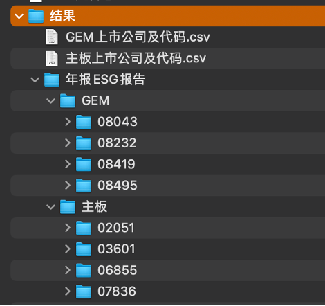
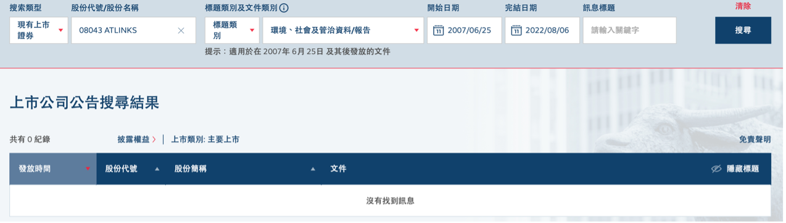

# Scrape ESG reports from HKEX
## 算法
#### 第一步：获取所有上市公司代码（主板+GEM）
网址：https://www1.hkexnews.hk/app/appindex.html?lang=zh
- 主板-已上市 901 家
- GEM-已上市 276 家
结果文件：
1. 主板上市公司及代码.csv
2. GEM上市公司及代码.csv
   * 主板和GEM的公司代码已经在运行时分别存在两个list里面

#### 第二步：爬取pdf并存档
1）	进入按标题搜索页面：https://www1.hkexnews.hk/search/titlesearch.xhtml?lang=zh  
2）	下拉框选择：   

    a)	搜索类型: 现有上市证券 / 已除牌证券   
    
    b)	输入股份代号   
    
    c)	标题类别及文件类别：标题类别–环境、社会及管治资料/报告   
    
    d)	输入公司后网页自动选择日期 – 2007/06/25 – 2022/08/06   
    
           * 标题类别适用于在2007年6月25日及其后发放的文件   
           
3）按搜索显示结果   

4）分别点按链接，下载对应pdf文档

## 用到的Python包
Selenium模拟鼠标，requests下载pdf，joblib并行运算

## 分公司搜索的原因
* 搜寻日期超过12个月需要选择股份
* 每页最多显示100条，超过需要翻页
* 分公司可以不用翻页
* 弊端：速度慢

## 更好的算法：利用披露易的API（如有），直接从源码爬取

## 待解决问题：
- 一些公司的ESG报告是嵌入年报里的
- 没有涉及退市公司的报告爬取
- 网站响应慢会导致爬取失败

## 爬取文件夹截图
（代码暂时设置为爬取前4家主板和前4家中小板）
 
 

注：GEM-08043 ATLINKS没有ESG报告披露，所以文件夹为空

 

## 完整代码文件
ScrapeHKEX_ESG.py (运行时需要修改路径)
